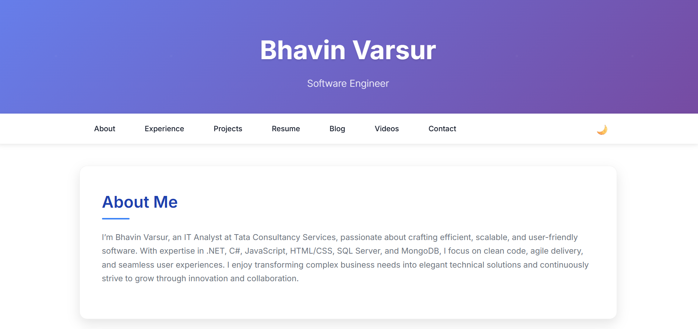
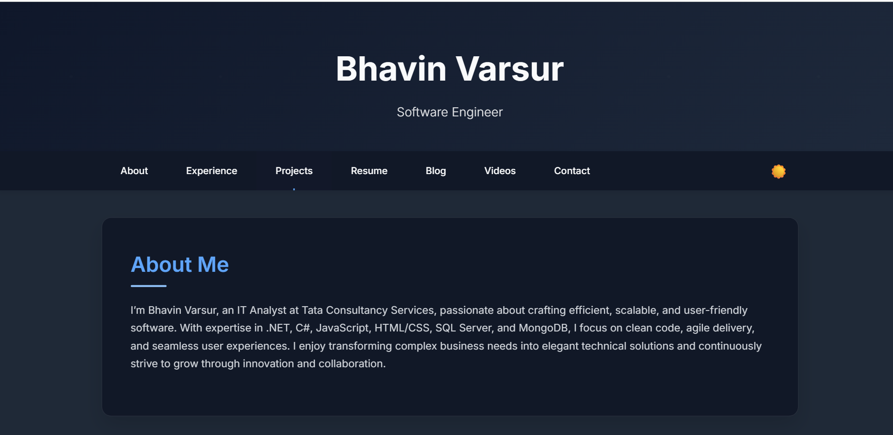

# 🌐 Bhavin Varsur's Portfolio

Welcome to my personal portfolio website — built with HTML, CSS, and JavaScript, and deployed via GitHub Pages at **[bvarsur.github.io](https://bvarsur.github.io)**.

This portfolio showcases my:
- 💼 Work experience  
- 🛠️ Skills & technologies  
- 📘 Blog posts  
- 🎥 Videos & tutorials  
- 📢 Contact information  

---

## 🚀 Live Site

👉 **[Visit Website](https://bvarsur.github.io)**

---

## 🖼️ Preview 

**Light Theme**  


**Dark Theme**  


---

## ✨ Features

- Responsive and mobile-friendly layout  
- Light/Dark theme toggle  
- Skills with animated progress bars  
- Project showcase with card UI  
- Blog section with syntax highlighting  
- Contact section with social links  
- Resume download button  
- Back-to-top floating button  
- GitHub-hosted and Jekyll-ready  

---

## 🧰 Tech Stack

- HTML5 / CSS3  
- JavaScript  
- GitHub Pages  
- Responsive Web Design  
- Dark Mode (CSS variables)  

---

## 📂 Project Structure

```bash
📁 root/
 ├ 📄 index.html          # Home page
 ├ 📄 style.css           # Main CSS styles
 ├ 📄 script.js           # Theme toggle and interactivity
 ├ 📄 README.md           # This file
 ┗ 📁 assets/             # Images, icons, media
```

To run locally:

```bash
git clone https://github.com/bvarsur/bvarsur.github.io.git
cd bvarsur.github.io
# Open index.html in your browser
```

---

## 🙋‍♂️ Connect

**Bhavin Varsur**  
🔗 [Connect with me on LinkedIn](https://www.linkedin.com/in/bhavin-varsur-254214146)
